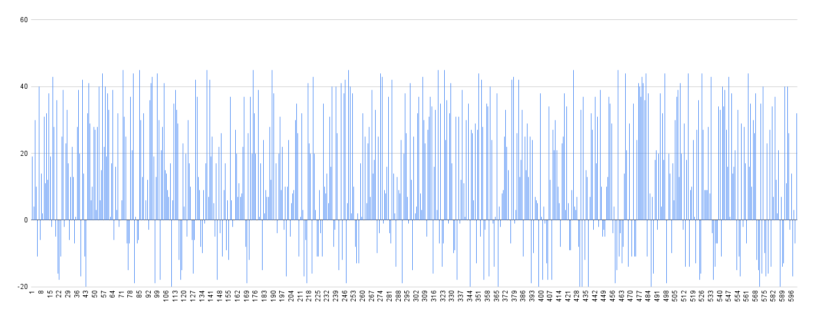

# Robô catador de latas

Para solucionar o problema do robô catador de latas proposto na disciplica de Computação evolutiva da Universidade Federal de Uberlândia foi desenvolvido um algoritmo genético simples. 

## Compreendendo o algoritmo desenvolvido

Nesta seção será especificada a arquitetura do algoritmo desenvolvido.

### Representação do cromossomo

O comprimento do cromossomo é baseado na dimensão do ambiente que o agente está inserido, ou seja, dado um mapa com dimensão nxn, o comprimento do cromossomo será igual a n². Além disso, cada gene do cromossomo equivale a uma ação possível de ser efetuada no ambiente, que neste caso seria para cima, para baixo, para esquerda e direita (0, 1, 2, e 3, respectivamente).

### Função objetivo

Para o cáculo da aptidão de cada indivíduo foi utilizado o suguinte passo a passo:
```
Enquanto: o indivíduo não executou a quantidade de ações equivalente à 90% da dimensão do mapa
  Será excutada uma ação referente à posição do cromossomo de acordo com a posição atual do indivíduo,
  ou seja, caso o indíviduo esteja na posição X do mapa, será executada a ação da posiação X do cromossomo.
  
  Caso a ação que será executa seja uma ação possível (não ultrapassa os limites do mapa e não é um movimento anulável) será obtida uma recompensa de acordo com a posição atual do agente no mapa:
      Caso exista uma lata de aço a recompensa obtida será igual a 10.
      Caso seja uma lata de alumínio será igual a -10.
      Caso não tenha nada a recompensa será igual a -1. 
  Caso contrário a recompesa será igual a -30.
  
  Essa recompensa obtida é somada à aptidão a cada ação executada de acordo com a posição atual do indivíduo. Caso sejam obtidas todas as latas de aço, o acúmulo
  de recompensas é interrompido.
```

### Seleção dos indivíduos

Para a seleção dos indivíduos ápitos para participarem do cruzamento foi utilizado o método da roleta. O qual cada indivíduo da população é representado na roleta proporcionalmente à sua aptidão.
Dessa forma, aos indivíduos com alta aptidão é dada uma porção maior da roleta, enquanto aos de aptidão mais baixa é dada uma porção relativamente menor da roleta.
Então, um número aletório entre 0 e 1 é gerado determinando qual porção da roleta será selecionada, isso é efetuada várias vezes até que os indivíduos suficientes sejam selecionados.

### Cruzamento dos indivíduos (Crossing over)

A fim de gerar novos indivíduos foi realizado o cruzamento dos indivíduos previamente selecionados. Primeiramente foram selecionados dois indivíduos a partir das suas aptidões. Essa seleção consistiu em ponderar cada aptidão com a soma de todas aptidões dos indivíduos selecionados. Dessa forma, a partir de um número aleatoriamente gerado no intervalo 0 e 1, um indivíduo foi selecionado, uma vez que cada aptidão compõe uma parte do intervalo de 0 a 1 de acordo com seu percentual. Tendo dois indivíduos selecionados com o processo descrito anteriormente, foi necessário escolher um ponto de corte k para fazer o cruzemento desses indivíduos. Assim, para escolher o ponto k um número aleatório foi escolhido, sendo esse um número inteiro pertencente ao intervalo [0, c - 1] | c é o tamanho do cromossomo. Vários indivíduos da população selecionada foram cruzados até que o tamanho da população ficasse com o tamanho da população previamente definida. A novo população consistiu em todos os indivíduos selecionados mais o indivíduos que foram gerados a partir do cruzamento.

### Mutação

O processo de mutação consiste em alterar um alelo do cromossomo aletoriamente. No algoritmo desenvolvido, a mutação foi utilizada quando um movimento não permitido (ultrapassar os limites do mapa e anular um movimento) era executado. 

---

## Experimentos realizados

No processo de geração dos indivíduos com o intuito de encontrar a solução do problema tratado foram executadas 600 épocas (tempo de geração de uma nova população). O gráfico abaixo foi gerado para o mapa 10x10 com as melhores aptidões ao longos das épocas.




